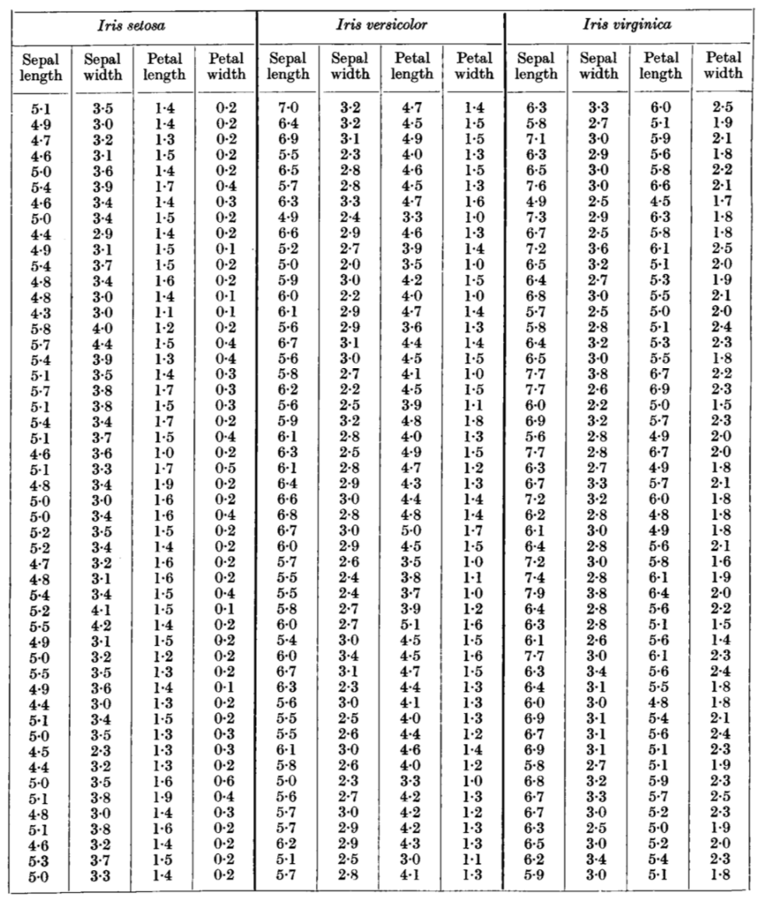

# iris_analysis
Final assignment for 2019, 52445 "Programming and Scripting" module, Higher Diploma in Data Analytics, Galway-Mayo Institute of Technology: examination and analysis of Fisher's Iris Data Set.

# Document Layout
1. [Who was Fisher?](https://github.com/thomas-roux/iris_analysis#who-was-fisher)
2. [What is the Iris Data Set?](https://github.com/thomas-roux/iris_analysis#what-is-the-iris-data-set)
3. [What does it contain?](https://github.com/thomas-roux/iris_analysis#what-does-it-contain)
4. [Findings of Interest](https://github.com/thomas-roux/iris_analysis#findings-of-interest)
5. [What others have done with the data set](https://github.com/thomas-roux/iris_analysis#what-others-have-done-with-the-data-set)
6. [Conclusion](https://github.com/thomas-roux/iris_analysis#conclusion)

## 1. Who was Fisher?
Ronald Aylmer Fisher was born in London, England in 1890. He went on to become a prolific author in statistics and genetics, with over 400 academic papers, and many advances in the field of statistics attributed to his name. Some of his key discoveries are noted below:

* 1912 -	Established that a sample mean is different from a population mean
* 1918 - 	Introduced the novel concept of variance
* 1919 - 	Progressed the field of statistics by inventing the tools of modern experimental design
* 1921 - 	Created the statistical method of analysis of variance (ANOVA) 
* 1922 - 	Developed the method of ‘maximum likelihood’, a method of estimating the parameters of a statistical model, given observations.
* 1924 - 	Created the F distribution for use in ANOVA
* 1925 -	Published Statistical Methods for Research Workers, a book considered on par with Isaac Newton’s Principia in physics.
* 1930 - 	Released The Genetical Theory of Natural Selection, unifying the theory of natural selection with Mendel’s laws of inheritance.
* 1933 -	Discovered the Rhesus blood group system, and established the Fisher-Race notation for Rhesus phenotypes and genotypes. 
* 1935 - 	Published The Design of Experiments, introducing the null hypothesis.
* 1952 -	Knighted by the Queen

Sir Ronald Aylmer Fisher died in 1962, having rightly earned himself a place as one of the imminent scientists of the 20th century.

**Sources:**    
- https://www.britannica.com/biography/Ronald-Aylmer-Fisher [Accessed 2019 April 2]
- https://www.famousscientists.org/ronald-fisher/ [Accessed 2 April 2019]
- Owen, ARG. (1962) 'An Appreciation of the Life and Work of Sir Ronald Aylmer Fisher', *Journal of the Royal Statistical    Society.   Series D (The Statistician)*, Vol. 12, No. 4, pp. 313-319

## 2. What is the Iris Data Set?
The Iris Data Set was first used by Fisher in his 1936 [publication](https://onlinelibrary.wiley.com/doi/abs/10.1111/j.1469-1809.1936.tb02137.x) 'The Use of Multiple Measurements in Taxonomic Problems' in *Annals of Human Genetics*, Vol 7, Issue 2, pg179-188, where Fisher used the data as an example of linear function discriminatio. Although Fisher spent time conducting plant-breeding expirements at the Rothamsted Experimental Station, he did not collect this data himself, but rather made use of data collected by [Dr E Anderson](https://en.wikipedia.org/wiki/Edgar_Anderson). 

The Iris Data Set, hereafter abbreviated to ISD, consists of measurements on three variations of iris flower: 

__*Iris Setosa*__

 

__*Iris Versicolor*__

 

__*Iris Virginica*__

For each flower, 4 measurements were taken: sepal length, sepal width, petal length and petal width. The following diagram identifies these parts of the Iris flower (Source: USDA Forest Service) 

Fifty flowers of each type were measured, giving a total IDS size of 150 observations. 

According to [Fisher](https://onlinelibrary.wiley.com/doi/abs/10.1111/j.1469-1809.1936.tb02137.x):

>there is some overlap of the distributions of *I. virginica* and *I. versicolor*, so that a certain diagnosis of these two species could not be based solely on these four measurements of a single flower (pg. 187).

Indeed, it is this clustering of the IDS into two distinct clusters (*I. virginica* and *I. versicolor*, and *I. setosa*) that makes this a useful data set for [explaining](https://en.wikipedia.org/wiki/Iris_flower_data_set#cite_note-anderson35-3) data mining techniques. 

## 3. What does it contain?
As already mentioned, the IDS contains 600 data points: 4 measurements for 50 flowers across 3 plant species (4 x 50 x 3 = 600). The data set from Fisher's original paper is presented below:

Imported from curran gihub [repository](https://gist.github.com/curran/a08a1080b88344b0c8a7#file-iris-csv)

## 4. Findings of interest

### Python Script
#### What it needs
#### What it does

### Results

## 5. What others have done with the data set

## 6. Conclusion

## Author

