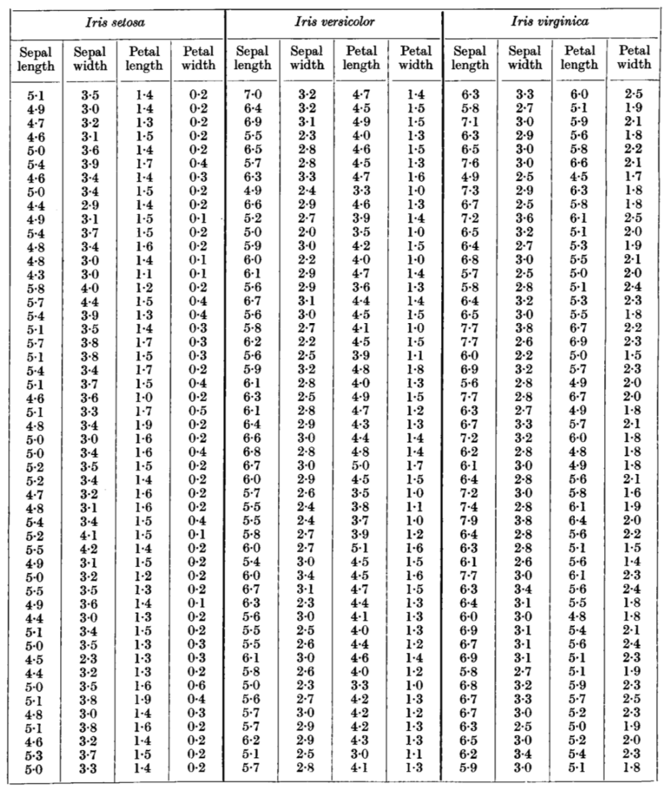
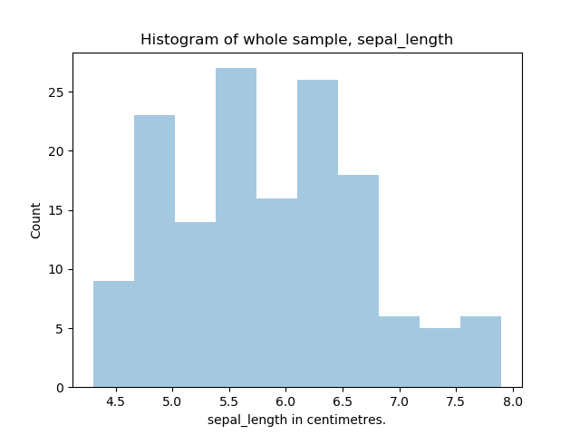
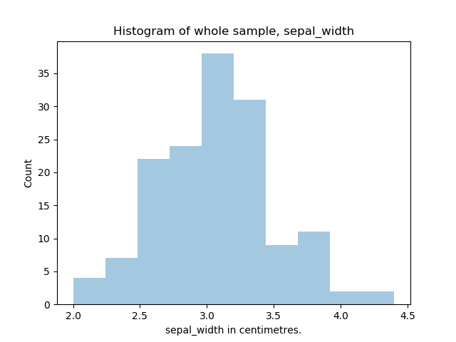
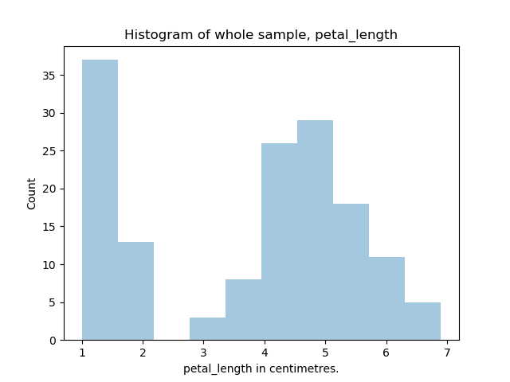
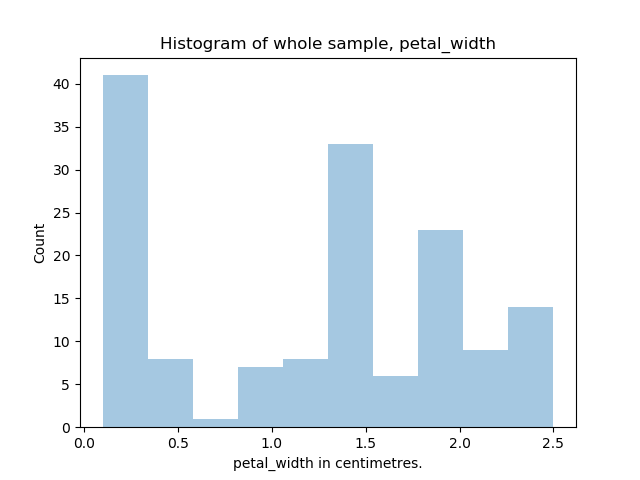

# iris_analysis
Final assignment for 2019, 52445 "Programming and Scripting" module, Higher Diploma in Data Analytics, Galway-Mayo Institute of Technology: examination and analysis of Fisher's Iris Data Set.

# Document Layout
1. [Who was Fisher?](https://github.com/thomas-roux/iris_analysis#1-who-was-fisher)
2. [What is the Iris Data Set?](https://github.com/thomas-roux/iris_analysis#2-what-is-the-iris-data-set)
3. [What does it contain?](https://github.com/thomas-roux/iris_analysis#3-what-does-it-contain)
4. [Findings of Interest](https://github.com/thomas-roux/iris_analysis#4-findings-of-interest)
5. [Discussion](https://github.com/thomas-roux/iris_analysis#4-discussion)
6. [What others have done with the data set](https://github.com/thomas-roux/iris_analysis#5-what-others-have-done-with-the-data-set)
7. [Conclusion](https://github.com/thomas-roux/iris_analysis#6-conclusion)
8. [References](https://github.com/thomas-roux/iris_analysis#6-references)


## 1. Who was Fisher?
Ronald Aylmer Fisher was born in London, England in 1890. He went on to become a prolific author in statistics and genetics, with over 400 academic papers, and many advances in the field of statistics attributed to his name. Some of his key discoveries are noted below:

* 1912 -	Established that a sample mean is different from a population mean
* 1918 - 	Introduced the novel concept of variance
* 1919 - 	Progressed the field of statistics by inventing the tools of modern experimental design
* 1921 - 	Created the statistical method of analysis of variance (ANOVA) 
* 1922 - 	Developed the method of ‘maximum likelihood’, a method of estimating the parameters of a statistical model, given observations.
* 1924 - 	Created the F distribution for use in ANOVA
* 1925 -	Published Statistical Methods for Research Workers, a book considered on par with Isaac Newton’s Principia in physics.
* 1930 - 	Released The Genetical Theory of Natural Selection, unifying the theory of natural selection with Mendel’s laws of inheritance.
* 1933 -	Discovered the Rhesus blood group system, and established the Fisher-Race notation for Rhesus phenotypes and genotypes. 
* 1935 - 	Published The Design of Experiments, introducing the null hypothesis.
* 1952 -	Knighted by the Queen

Sir Ronald Aylmer Fisher died in 1962, having rightly earned himself a place as one of the imminent scientists of the 20th century.

## 2. What is the Iris Data Set?
The Iris Data Set was first used by Fisher in his 1936 [publication](https://onlinelibrary.wiley.com/doi/abs/10.1111/j.1469-1809.1936.tb02137.x) 'The Use of Multiple Measurements in Taxonomic Problems' in *Annals of Human Genetics*, Vol 7, Issue 2, pg179-188, where Fisher used the data as an example of linear function discrimination. Although Fisher spent time conducting plant-breeding expirements at the Rothamsted Experimental Station, he did not collect this data himself, but rather made use of data collected by [Dr E Anderson](https://en.wikipedia.org/wiki/Edgar_Anderson). 

The Iris Data Set, hereafter abbreviated to ISD, consists of measurements on three variations of iris flower: 

__*Iris Setosa*__

 

__*Iris Versicolor*__

 

__*Iris Virginica*__


For each flower, 4 measurements were taken: sepal length, sepal width, petal length and petal width. Fifty flowers of each type were measured, giving a total IDS size of 150 observations. The following diagram identifies the parts of an Iris flower (Source: USDA Forest Service) 
 


To the eye, there does not appear to be much difference between the iris flower configurations in the images. However, based on measurements, these three species of Iris flowers can be clustered into two groups: *I. virginica* and *I. versicolor* in one cluster, and *I. setosa* in the other. According to [Fisher](https://onlinelibrary.wiley.com/doi/abs/10.1111/j.1469-1809.1936.tb02137.x):

>there is some overlap of the distributions of *I. virginica* and *I. versicolor*, so that a certain diagnosis of these two species could not be based solely on these four measurements of a single flower (pg. 187).

It is this grouping of the IDS into two distinct clusters that makes this a useful data set for [explaining](https://en.wikipedia.org/wiki/Iris_flower_data_set#cite_note-anderson35-3) data mining techniques. 

## 3. What does it contain?
As already mentioned, the IDS contains 4 measurements for 50 flowers across 3 plant species, giving a total of 600 data points, not including Iris species (4 x 50 x 3 = 600). Apart from species name, which is nominal data, all other data is interval data. The data set from Fisher's original paper is presented below:



## 4. Findings of interest
This next section will look at the Python script used to analyse the data, as well as some results of the analysis. The data set used for this analysis was downloaded from curran's github [repository](https://gist.github.com/curran/a08a1080b88344b0c8a7#file-iris-csv). 

A ['results.txt'](https://github.com/thomas-roux/iris_analysis/blob/master/results.txt) file contains all the output as displayed on the terminal when running the program. This was created by using the `open()` function as explained [here](https://stackoverflow.com/a/36571602). The `file=f` statements have subsequently been removed from the program script.

### Python Script
#### What it needs
In order to run the Python script, you will need to install Python. Python is freely available, and details on how to install and run Python on your native OS are available [here](https://docs.python.org/3/using/index.html). In addition, you will need to download and install [pandas](http://pandas.pydata.org/pandas-docs/stable/install.html#installing-pandas), [NumPy](http://www.numpy.org/), [matplotlib](https://matplotlib.org/users/installing.html), and [seaborn](https://seaborn.pydata.org/index.html).

Alternatively, you can download the free open-source [Anaconda Distribution](https://www.anaconda.com/distribution/) package that includes over 1,500 packages in addition to the latest version of Python. This would preclude the need to download additional packages as mentioned above.

Before running the script in Python, make sure you have downloaded the IDS from curran's github [repository](https://gist.github.com/curran/a08a1080b88344b0c8a7#file-iris-csv). Save the dataset as **irisdataset.csv** in a subfolder **data** within the same folder as the script to ensure it executes correctly. If you prefer, you can save the dataset in any folder with any ***.csv** filename - just make sure to change the destination folder in line 24 of the analysis.py script before proceeding:
```python
data = pd.read_csv('data/irisdataset.csv', delimiter = ',')
```

The code automatically creates an **'/images** subdirectory when saving images. At the outset, the code is set up not to save images - a hashtag before the following code lines needs to be removed before images will be saved:

Line 13:
```python
os.mkidr('images')
```

Lines 52, 68, 79, 88:
```python
plt.savefig('images/<filename>')
```

#### What it does
First, the program determines if there is any missing data by identifying standard terms used by pandas for each variable. 

The program then prints the following descriptive statistics:
- mean  
- standard deviation 
- minimum
- maximum
- quartiles 
of the whole sample and of each Iris species. In addition, it plots a histogram of all variables for the entire sample. It also plots a boxplot of each variable across each Iris species in turn. These descriptive statistics can then be used to make an informed decision on normality of data distribution for further inferential statistics.

The program then displays a scatterplot of all variables to one another for the whole sample, and again for each species in turn. Finally, a correlation matrix of each variable for the entire sample, and between each species, is determined. 

All images created are saved into an **'/images'** subdirectory if the necessary code is active (see above).

### Results
As already mentioned, there are 5 data points for each observation, totalling 750 data points in total for all 150 observations. The initial check to show whether any data is missing reveals that all data points are present:

**Missing values in data set per variable:**
--- | ---
sepal_length  |0
sepal_width   |0
petal_length  |0
petal_width   |0
species       |0

The next output is a set of descriptive statistics (mean, standard deviation (SD), min, max) for the whole sample. The program also outputs count and quartiles (not shown):
**Descriptive statistics, ungrouped (values rounded to 1 decimal space)**
Sepal Length | Sepal Width | Petal Length | Petal Width
--- | --- | --- | ---
Mean    |   5.8   |  3.1 |   3.8  |   1.2
SD      |   0.8   |  0.4 |   1.8  |   0.8
Min     |   4.3   |  2.0 |   1.0  |   0.1
Max     |   7.9   |  4.4 |   6.9  |   2.5

These results are presented graphically in the following histograms:
**Sepal Length, Ungrouped**


**Sepal Width, Ungrouped**


**Petal Length, Ungrouped**


**Petal Width, Ungrouped**


The descriptive statistices grouped by plant species are as follows:
**Descriptive statistics, *I. setosa* (values rounded to 1 decimal spaces)**
Sepal Length | Sepal Width | Petal Length | Petal Width
--- | --- | --- | ---
Mean |   5.0  |  3.4 |   1.5  |   0.2
SD   |   0.4  |  0.4 |   0.2  |   0.1
Min  |   4.3  |  2.3 |   1.0  |   0.1
Max  |   5.8  |  4.4 |   1.9  |   0.6

**Descriptive statistics, *I. versicolor* (values rounded to 1 decimal spaces)**
Sepal Length | Sepal Width | Petal Length | Petal Width
--- | --- | --- | ---
Mean |   5.9  |  3.4 |   1.5  |   0.2
SD   |   0.5  |  0.4 |   0.2  |   0.1
Min  |   4.9  |  2.3 |   1.0  |   0.1
Max  |   7.0  |  4.4 |   1.9  |   0.6

  
## 5. Discussion

## 6. What others have done with the data set

## 7. Conclusion

## 8. References
- https://github.com/adam-p/markdown-here/wiki/Markdown-Cheatsheet
- https://www.britannica.com/biography/Ronald-Aylmer-Fisher [Accessed 2019 April 2]
- https://www.famousscientists.org/ronald-fisher/ [Accessed 2 April 2019]
- Owen, ARG. (1962) 'An Appreciation of the Life and Work of Sir Ronald Aylmer Fisher', *Journal of the Royal Statistical    Society.   Series D (The Statistician)*, Vol. 12, No. 4, pp. 313-319
- Coding references contained in **analysis.py**

## Author